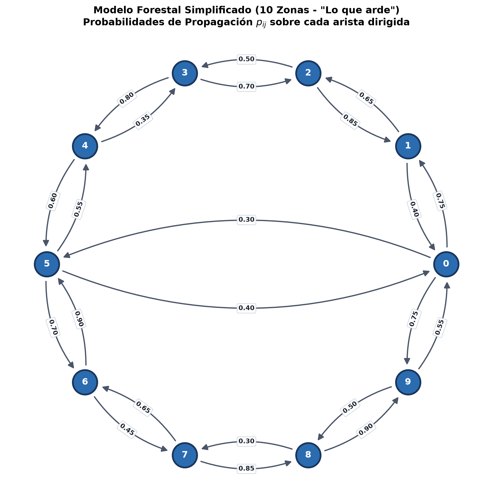
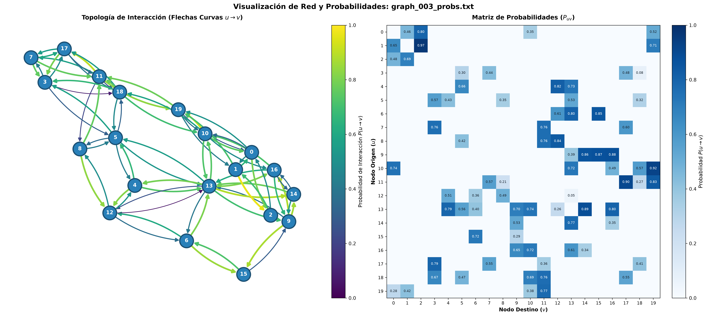

# 🔥 Lo que arde — Modelado Estocástico de Propagación de Incendios Forestales

[](https://www.python.org/downloads/)
[](LICENSE)
[](https://github.com/astral-sh/ruff)

Modelado matemático, dinámico y estocástico de propagación de frentes de fuego sobre redes espaciales complejas, desarrollado en el marco del **Concurso de Modelado Matemático 2026** e inspirado en el contexto forestal de la película *Lo que arde* (Óliver Laxe).

---

## 🌲 1. Fundamentos del Modelo Matemático

### Estructura Espacial del Bosque
El bosque se discretiza en $n$ zonas homogéneas interconectadas, modeladas formalmente como un **grafo dirigido** $G = (N, A)$:
- $N = \{0, 1, \dots, n-1\}$ representa el conjunto de nodos o parcelas forestales.
- $A \subset N \times N$ es el conjunto de aristas dirigidas (arcos), cumpliendo la simetría de adyacencia pero asimetría de transmisión:
  $$(i, j) \in A \iff (j, i) \in A, \quad \text{con } p_{ij} \neq p_{ji} \text{ en general}$$
- Cada arco $(i, j) \in A$ posee una probabilidad estocástica $p_{ij} \in [0, 1]$ de que el fuego se propague desde la zona activa $i$ hacia la zona susceptible $j$.

### Dinámica Temporal y Frente de Fuego
- **Tiempo discreto:** La propagación ocurre en etapas $t = 0, 1, 2, \dots$
- **Frentes activos ($I_t$):** Conjunto de nodos que se encienden exactamente en la etapa $t$.
- **Zonas quemadas acumuladas ($Q_t$):** $Q_t = \bigcup_{t' < t} I_{t'}$. El fuego finaliza cuando $I_T = \emptyset$.
- **Mecanismo de Ignición Estocástica:** Cada nodo activo $j \in I_t$ intenta propagarse a sus vecinos susceptibles **una única vez y de forma estadísticamente independiente**.

### Formulación Probabilística Exacta
Frente a aproximaciones lineales simples $\sum_j b_j p_{ji}$ (que violan el axioma de acotación de Kolmogorov $\mathbb{P} \le 1$), la probabilidad exacta de que una zona susceptible $x_i$ se encienda es la **probabilidad complementaria** de que fallen todos los intentos de sus vecinos activos:

$$\mathbb{P}(x_i \text{ recibe fuego}) = 1 - \prod_{j=1}^n (1 - p_{ji})^{b_j}$$

La probabilidad de que $x_i$ se convierta en un **nuevo frente** ($x_i \in I_{t+1}$) condicionada al estado anterior es:

$$\delta_i = \mathbb{P}(x_i \in I_{t+1}) = \left( 1 - \prod_{j=1}^n (1 - p_{ji})^{b_j} \right) \cdot (1 - b_i)$$

donde $\mathbf{b} \in \{0, 1\}^n$ es el vector binario de zonas activas en la etapa actual.

---

## 📁 2. Estructura del Repositorio

```text
.
├── Datos/
│   └── Datos/
│       ├── graph_003_probs.txt   # Grafo dirigido con 20 nodos y 78 aristas (probabilidades)
│       ├── graph_004_probs.txt   # Conjunto de datos alternativo
│       ├── graph_005_probs.txt   # Conjunto de datos alternativo
│       ├── graph_007_probs.txt   # Conjunto de datos alternativo
│       ├── graph_008_probs.txt   # Conjunto de datos alternativo
│       ├── graph_010_probs.txt   # Conjunto de datos alternativo
│       └── inicio.txt            # Vector de distribución de ignición inicial
├── visualizar_grafo.py           # Visualizador de topología y matriz térmica para conjuntos de datos
├── ejemplo_simple_10_nodos.py    # Ejemplo simplificado de 10 nodos con números sobre aristas (sin colisiones)
├── foo2.py                       # Cálculo vectorial en NumPy de la dinámica de propagación estocástica
├── GEMINI.md                     # Documento de contexto teórico y resolución analítica
├── pyproject.toml                # Especificación del paquete y herramientas de desarrollo
├── requirements.txt              # Dependencias del entorno
├── LICENSE                       # Licencia MIT
└── README.md                     # Documentación principal
```

---

## 🚀 3. Instalación

Se recomienda Python 3.10 o superior.

### Usando `venv` estándar:

```bash
# Crear y activar entorno virtual
python3 -m venv .venv
source .venv/bin/activate

# Instalar dependencias
pip install -r requirements.txt
```

### O en modo editable con `pip`:

```bash
pip install -e .
```

---

## 💻 4. Uso y Ejemplos

### A. Ejemplo Simplificado (10 Nodos con Probabilidades sobre Aristas)
Genera una red forestal de 10 parcelas con flechas curvas bidireccionales y etiquetas numéricas calculadas analíticamente sobre las curvas Bézier para evitar solapamientos de texto:

```bash
# Ejecutar y abrir visor interactivo
python ejemplo_simple_10_nodos.py

# Guardar directamente en imagen sin abrir ventana
python ejemplo_simple_10_nodos.py --no-show -o ejemplo_10_nodos.png
```

### B. Visualizador de Redes y Matrices de Datos Reales
Carga conjuntos de datos del concurso (como `graph_003_probs.txt`, 20 nodos y 78 arcos) generando paneles comparativos:

```bash
# Panel completo (topología + matriz de adyacencia de probabilidades)
python visualizar_grafo.py

# Modo solo red topológica
python visualizar_grafo.py --mode grafo -o topologia.png

# Modo solo matriz de calor P(u -> v)
python visualizar_grafo.py --mode matriz -o matriz.png

# Visualizar otro archivo de datos
python visualizar_grafo.py --file Datos/Datos/graph_004_probs.txt
```

### C. Dinámica Vectorial Estocástica
Calcula la evolución de ignición exacta a partir de un estado activo $\mathbf{b}$:

```bash
python foo2.py
```

---

## 📊 5. Galería Visual

| Ejemplo Simplificado (10 Nodos sin solapamientos) | Panel Completo (Red + Matriz de Transición) |
| :---: | :---: |
|  |  |

---

## 🎯 6. Retos del Concurso

1. **Reto 1 (Prevención a priori):** Localización estática óptima de $k=4$ cortafuegos antes del inicio del fuego para minimizar el daño esperado tras $s=2$ etapas.
2. **Reto 2 (Escenario determinista):** Juego dinámico por turnos ($p_{ij}=1$) donde los bomberos colocan $k=2$ cortafuegos tras cada expansión.
3. **Reto 3 (Propagación estocástica adaptativa):** Control dinámico colocando $k=1$ cortafuego por etapa bajo propagación probabilística general.
4. **Reto 4 (Optimización adversaria / Teoría de juegos):** Elección óptima de nodo de ignición por parte de un pirómano frente a la respuesta de los bomberos.
5. **Reto 5 (Generalización y física continua):** Modelado con factores topográficos (pendiente) y meteorológicos (viento).

---

## 📄 Licencia

Este proyecto está bajo la Licencia MIT. Consulta el archivo [LICENSE](LICENSE) para más detalles.
